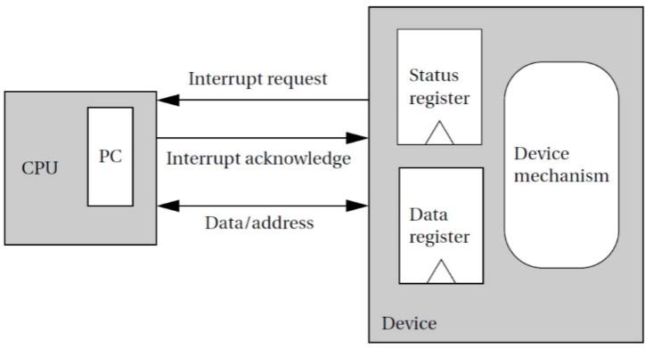
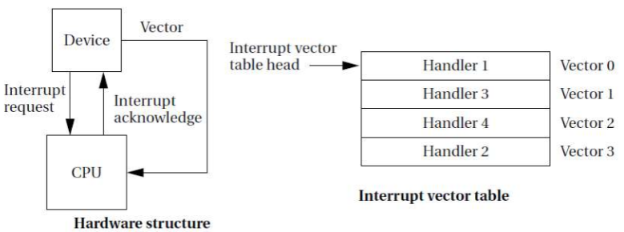
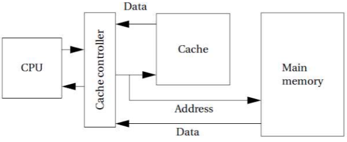
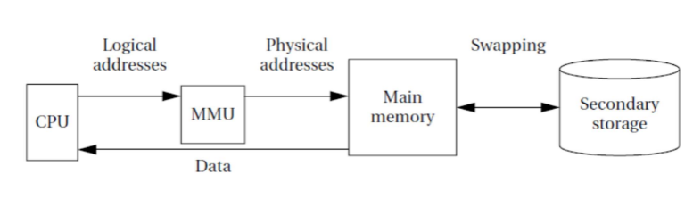
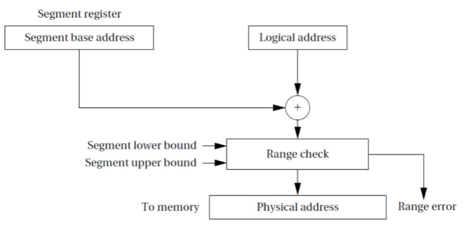
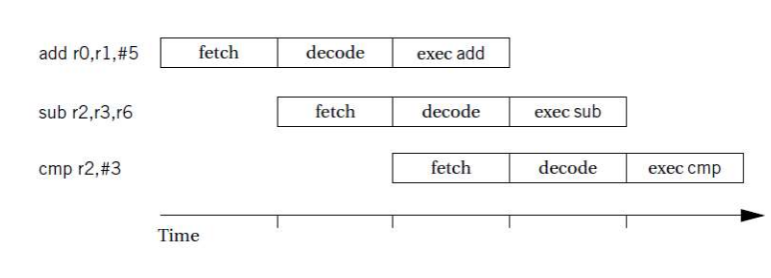

# Introducción a los microcontroladores

## Dispositivos de E/S

Suelen contener dispositivos analógicos o incluso no electrónicos.

La CPU se comunica con ellos a través de registros de E/S.
* Registros de datos: Lectura y escritura.
* Registros de estado y control: Proporcionan información sobre la situación del periférico y establecen su configuración.

La CPU es mucho más rápida que la mayoría de periféricos. Debe esperar:
* Consulta de estado: La CPU pregunta al periférico si está listo para recibir o enviar datos.
* Interrupciones: El periférico avisa a la CPU de que tiene datos para enviar o recibir.

Como la CPU es muy rapido, debemos estar constantemente dejando ocupado a la CPU para que no se quede esperando.

Cuando trabajamos con interrupciones, la CPU para de hacer lo que está haciendo y ejecuta una rutina de interrupción. Al finalizar la rutina, la CPU vuelve a lo que estaba haciendo.

## Interrupciones

La atención de la interrupción consiste en la ejecución de una rutina de servicio.

* La CPU debe guardar el estado actual del programa. 

La rutina de servicio debe salvaguardar todos los registros que empleará para evitar que cambien en el programa principal.
* Uno de los aspectos más importantes de la rutina es el restablecimiento de los registros a su estado original.

Una vez atendida la interrupción, la rutina de servicio restablecerá los valores de los registros.

* Cuando se produce una interrupción, la CPU debe:
  * Guardar el estado actual del programa.
  * Ejecutar la rutina de servicio.
  * Restaurar el estado del programa.

Muchas CPUs usan el mismo mecanismo para las interrupciones que para las subrutinas.
* Como se puede llegar a tener muchas interrupciones se usa una pila para guardar las direcciones de retorno.

### Prioridades

Las interrupciones pueden tener prioridades.

* La mayoría de sistemas tienen más de un periférico.
* Cada uno de ellos puede disponer de su propia interrupción asociada.
* Ante varias peticiones simultáneas de interrupción, se establece un sistema de prioridades.
* Un dispositivo de menor prioridad se dice que está enmascarado mientras se atiende a otro de mayor prioridad

Ls estructura de prioridades puede ser:
* Si se produce una interrupción de mayor prioridad mientras se está atendiendo otra, se atiende la de mayor prioridad.
* Si se produce una interrupción de igual prioridad, se atiende la que llegó primero.
* Si se produce una interrupción de menor prioridad, se atiende cuando se haya terminado de atender la de mayor prioridad.

Cuando trabajado con niveles de interrupcion, existe una mascara de 0 o 1 para cada nivel de interrupción. Si la mascara es 0, la interrupción se atiende, si es 1, no se atiende.

### Vectorización

La CPU debe saber qué rutina de servicio ejecutar.

Para la identificación de la fuente de interrupción se emplean dos técnicas:
* No vectorizadas: Una consulta de estado determina qué dispositivo solicitó atención.
* Vectorizadas: El dispositivo informa a la CPU de su identidad para consultar la tabla de vectores de interrupción.

### Resumen

Una de caracteristica impresindible es que una de las fases impresindibles si las fases del NMI es la de guardar el estado del programa.

1. La CPU consulta la existencia de una interrupción al inicio de cada instrucción, confirmando la asistencia a la de mayor prioridad que se encuentre activa.
2. El dispositivo recibe la confirmación y envía su vector de interrupción.
3. La CPU encuentra la dirección de la rutina de servicio y realiza una llamada de subrutina a esa dirección.
4. La rutina de servicio atiende al periférico y ejecuta una instrucción de retorno de interrupción.
5. La CPU restaura el estado anterior a la atención de la interrupción.

### Coste de las interrupciones

El coste de una interrupción es el tiempo que tarda la CPU en atenderla.

* Coste similar al de una subrutina.
* Salvaguarda automática de registros.
* Reconocimiento de la interrupción. Segun el tipo de interrupción, puede ser más o menos costoso.
* Obtención del vector.
* Penalización por salto a rutina de servicio. Las penalizaciones por saltos se deben a las pipe lines de las CPUs, lo que hace que se pierda tiempo en la ejecución de la instrucción y se pierda la información de la siguiente instrucción.
* Salvaguarda de registros no automática.
* Penalización por salto de regreso.
* Recuperación de registros salvaguardados.

Todo este listado son las acciones que se deben de realizar para atender una interrupción.

## Modo supervisor

El modo supervisor es un modo de operación de la CPU que permite a la CPU ejecutar instrucciones privilegiadas.

* Las instrucciones privilegiadas son aquellas que pueden acceder a recursos que no están disponibles para el usuario.
* Errores en programas pueden bloquear el procesador, especialmente cuando varios programas se ejecutan simultáneamente.
* El modo supervisor impide el acceso a determinados elementos a los programas que se ejecutan en modo usuario.

## Excepciones

Las excepciones son interrupciones que se producen en el propio procesador.

* Se trata de la detección de un error interno, por ejemplo división por cero.
* El mecanismo de la excepción proporciona una forma de reaccionar ante eventos inesperados. Eso se debe a que normalmente son de tipo asincrono.
* Suele emplearse el mecanismo de las interrupciones para atenderlas
* Suelen presentar prioridades y vectorización.

## Interrupciones software

Las interrupciones software son interrupciones que se generan por el programador.

* También conocidas como traps. Se trata de instrucciones que generan excepciones explícitamente.
* Habitualmente se usan para entrar en modo supervisor.
* Permiten ejecutar subrutinas preestablecidas del Sistema Operativo.

## Coprocesadores

Los coprocesadores son dispositivos que se conectan a la CPU para realizar tareas específicas.

* Para dar flexibilidad, en ocasiones algunas instrucciones se implementan en coprocesadores (coma flotante, etc.).
* Las instrucciones asociadas se pueden ejecutar por HW o por SW (interrupción SW si el coprocesador no está presente, para proporcionar compatibilidad).
* La ejecución puede ser con espera o en paralelo (superescalar).

El coprocesador es un chip que se conecta a la CPU para realizar tareas específicas. Por ejemplo, el coprocesador de coma flotante.

## Sistemas de memoria

Los sistemas de memoria son los encargados de almacenar los datos y las instrucciones.

* Los procesadores son mucho más rápidos que las memorias. Se hace necesario el uso de memorias cache.
* Por otro lado, la cantidad de memoria necesaria para las aplicaciones actuales es cada vez mayor, lo cual lleva al uso de memoria virtual.

## Memoria cache

La memoria cache es una memoria de alta velocidad que se sitúa entre la CPU y la memoria principal.

* La memoria cache almacena los datos e instrucciones que se utilizan con mayor frecuencia.
* La memoria cache es mucho más rápida que la memoria principal.
* La memoria cache se organiza en bloques de tamaño fijo.
* Las caches pueden ser de acceso directo y asociativas.

* Cuando el dato buscado no se encuentra en la cache, se produce un fallo de cache.
* Hay tipos estándar de fallos de cache:
  * Fallo compulsivo o fallo frío: La primera vez que se accede a un dato.
  * Fallo por capacidad: Cuando se accede a una estructura de datos de gran tamaño.
  * Fallo por conflicto: Cuando a dos datos de la memoria les corresponde la misma ubicación en la cache.

## Memoria virtual

Para usar más memoria de la físicamente disponible, se recurre a la memoria virtual.

La memoria virtual es una técnica que permite al sistema operativo y a los programas tratar la memoria como si fuera mucho mayor que la físicamente disponible.

El controlador de memoria virtual realiza la conversión entre direcciones físicas y virtuales.

## Rendimiento del procesador

El rendimiento de un procesador se mide en MIPS (Millones de Instrucciones Por Segundo).

Al plantearnos cómo de rápido puede ejecutar las instrucciones un procesador, hay dos técnicas que pueden afectar sustancialmente al rendimiento:
* Pipeline: Estructura del procesador en la cual la ejecución de una instrucción se fracciona en fases que se ejecutan de forma simultánea.
* Cache: Gestión de la memoria de alta velocidad para aumentar el rendimiento global del sistema.

## Pipeline

El pipeline es una técnica que permite ejecutar varias instrucciones simultáneamente. Las fases en que se divide la ejecución de una instrucción son:
* Fetch (búsqueda): La instrucción es localizada en memoria y copiada en el registro correspondiente.
* Decode: La instrucción es decodificada para determinar qué señales de control habrá que activar para ejecutarla.
* Execution: Las señales de control se activan de forma adecuada para que la instrucción sea ejecutada.

Como las unidades funcionales que realizan las fases de ejecución son independientes, varias instrucciones se procesan a la vez:

## Cache

Los fallos de cache pueden ser evitables, pero algunos son inevitables:
* En un fallo compulsivo, la dirección no ha sido referenciada con anterioridad.
* En un fallo por conflicto, dos direcciones compiten por la misma ubicación de cache.
* En un fallo de capacidad, el programa es demasiado grande para la cache

La estrategia de gestión de la cache es decisiva en el rendimiento del procesador.

## Consumo

El consumo de un procesador es un factor importante a tener en cuenta.

Hay dos magnitudes relacionadas con el consumo:
* Energía: Importante en el caso de que el sistema se alimente con baterías.
* Potencia: Energía por unidad de tiempo. Más relacionada con la disipación térmica.

Actualmente la mayoría de circuitos son del tipo CMOS, lo cual implica una serie de propiedades respecto del consumo.

El consumo de energía de los circuitos CMOS depende del cuadrado del voltaje de alimentación.

Reduciendo el voltaje de alimentación podemos reducir el consumo en mayor medida que la reducción de voltaje realizada

Los circuitos CMOS consumen especialmente en los cambios de valor. Hay dos formas de reducir el consumo:
* Reducir la frecuencia de trabajo. Reducimos la potencia disipada pero no el consumo de energía.
* Reducir el número de transiciones. Optimizando los programas podemos evitar que los valores binarios realicen cambios innecesarios.

Incluso en reposo los circuitos CMOS presentan consumo.

Desconectando las unidades funcionales no usadas podemos reducir el consumo del procesador.

La reactivación de las unidades suele presentar un coste temporal que afecta a las prestaciones.